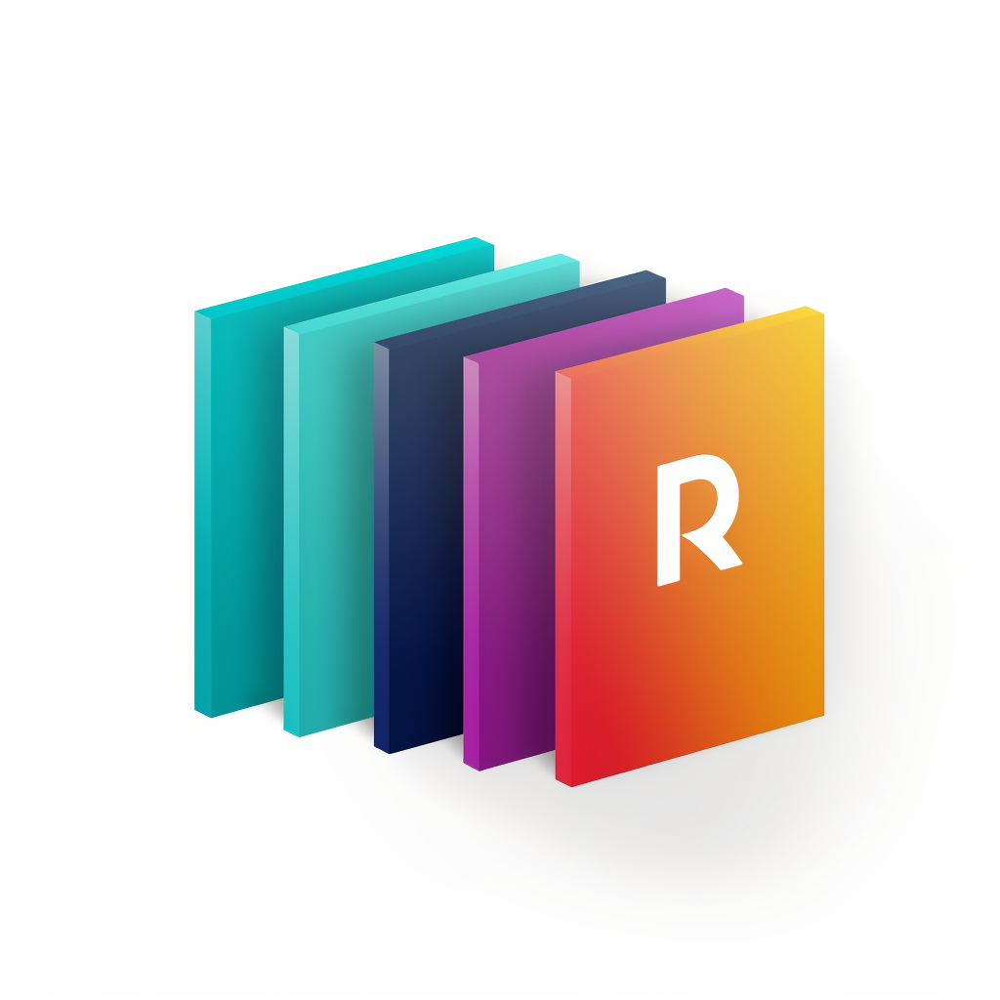

<p align="center">
    
    
    
    
</p>

[简体中文] | [[English](docs/README_EN.md)]

#  Resume Pilot 简历筛选

### 使用 Docker 部署 Redis 服务

1. 拉取 Redis 镜像：

```shell
docker pull redis
```

2. 运行 Redis 容器，并设置密码：(请到`config.py`中修改Redis的密码)

```shell
docker run -d --name myredis --restart=always -p 6379:6379 redis redis-server --requirepass resume@1234
```

3. 测试连接：

```shell
redis-cli -h localhost -p 6379 -a resume@1234
```

### 安装-直接运行 (Windows, Linux or MacOS)

1. 下载项目

```sh
git clone https://gitlab.com/lemu-tech/resume-pilot.git
cd resume-pilot
```

2. 配置API_KEY
   在`config.py`中，配置API KEY，点开该[链接](https://platform.openai.com/account/api-keys)可以访问您的OpenAI的key。

3. 安装依赖：

```sh
python -m pip install -r requirements.txt
# 备注：使用官方pip源或者阿里pip源，其他pip源（如一些大学的pip）有可能出问题，临时换源方法：python -m pip install -r requirements.txt -i https://mirrors.aliyun.com/pypi/simple/
```

4. 运行

```sh
python main.py
```

### 使用Dockerfile构建镜像并运行

1. 如何构建:

```shell
修改 config.py 的配置信息

docker build -t resume-pilot:latest .
```

2. 如何运行: 在运行 Docker 容器时，使用 `--network=host` 参数将容器与主机网络共享。这样，在容器中就可以通过访问主机 IP
   地址来访问宿主机上运行的 Redis 服务。

```shell
docker run -d -p 61215:61215 --restart always --network=host --name resume-pilot resume-pilot:latest
````

### [体验地址](http://www.kizait.cn:61215)
* user: admin
* pwd: admin

#### 操作步骤：
1. 打开体验网址，输入帐号密码。
2. 进到主界面，可以点击读取之前存储的招聘需求，会在需求输入框显示，如果没有会提示为空，需要重新输入，可以参考提示的模板。


3. 输入完目标需求，需要点击**确认招聘需求**按钮才能把目标需求进行存储。
4. 上传PDF文件（同时支持tar、7z的压缩文件，可以把多个PDF文件放在一个压缩包中），如果文件过多需要稍微等待文件上传完成，上传完成后页面会提示已上传的文件。
5. 解析简历，点击`批量对简历进行解析匹配`的按钮，等待gpt对简历进行解析并生成报告即可。
6. 下载报告汇总表和目标简历的压缩文件。


### 已知问题
1. Gradio目前不支持在同一界面上直接修改已渲染的组件，所以暂还不支持多语言切换，想实现语言切换只能通过修改配置文件的方式。

### 运行效果

