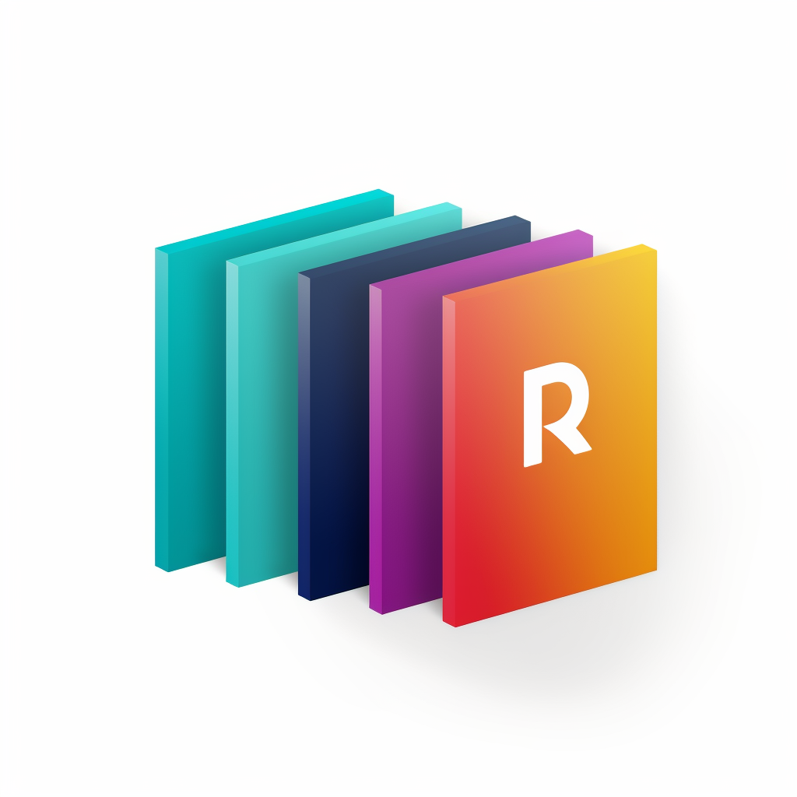

<p align="center">
    
    
    
    
</p>

[[简体中文](../README.md)] | [English]

#  Resume Pilot Resume Screening

### Deploy Redis service with Docker

1. Pull Redis image:

```shell
docker pull redis
```

2. Run Redis container and set password: (Please modify the Redis password in `config.py`)

```shell
docker run -d --name myredis -p 6379:6379 redis redis-server --requirepass lemu@1215
```

3. Test Connection：

```shell
redis-cli -h localhost -p 6379 -a lemu@1215
```

### Installation and Running (Windows, Linux, or MacOS)

1. Download the project

```sh
git clone https://gitlab.com/lemu-tech/resume-pilot.git
cd resume-pilot
```

2. Configure API_KEY
   In `config.py`, configure the API KEY. Click on this [link](https://platform.openai.com/account/api-keys) to access your OpenAI key.

3. Install dependencies:

```sh
python -m pip install -r requirements.txt
# Note: Use the official pip source or Aliyun pip source. Other pip sources (such as some university pip sources) may cause issues. To temporarily change the source, use this command: python -m pip install -r requirements.txt -i https://mirrors.aliyun.com/pypi/simple/
```

4. Run the application

```sh
python main.py
```

### Build Docker image with Dockerfile and run

1. How to build:

```shell
Modify the configuration information in config.py

docker build -t resume-pilot:latest .
```

2. How to run: When running the Docker container, use the `--network=host` parameter to share the container network with the host. In this way, the Redis service running on the host can be accessed in the container through the host IP address.

```shell
docker run -d -p 61215:61215 --restart always --network=host --name resume-pilot resume-pilot:latest
````

### [Demo Address](http://183.234.102.178:61215)
* user: admin
* pwd: admin

#### Operation steps：
1. Open the demo address and enter the username and password.
2. In the main interface, click to read the previously stored recruitment requirements, which will be displayed in the input box. If there is none, you will be prompted to enter it again. You can refer to the template as a guide.
3. After entering the target requirements, you need to click the "Confirm Recruitment Requirements" button to store the target requirements.
4. Upload PDF files (compressed files in tar and 7z format are also supported, and multiple PDF files can be placed in one compressed package). If there are too many files, please wait for the files to be uploaded. After the upload is complete, the page will display the uploaded files.
5. Analyze the resume, click the "Batch Analyze and Match Resumes" button, and wait for GPT to analyze the resumes and generate a report.
6. Download the report summary.

### Known issues
1. Gradio currently does not support directly modifying rendered components on the same interface, so it does not yet support language switching. To implement language switching, you can modify the configuration file.

### Running effect

